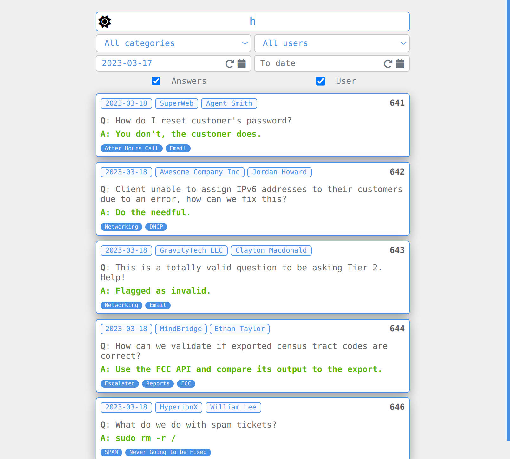
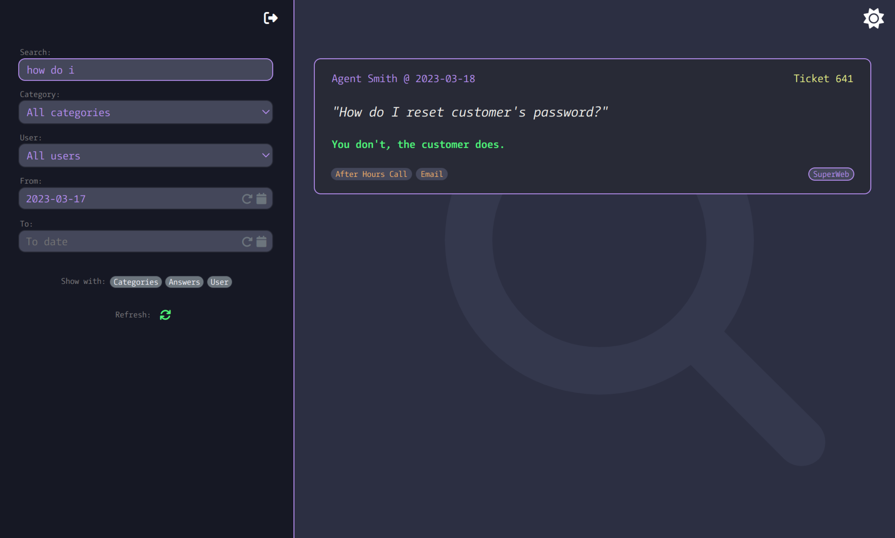
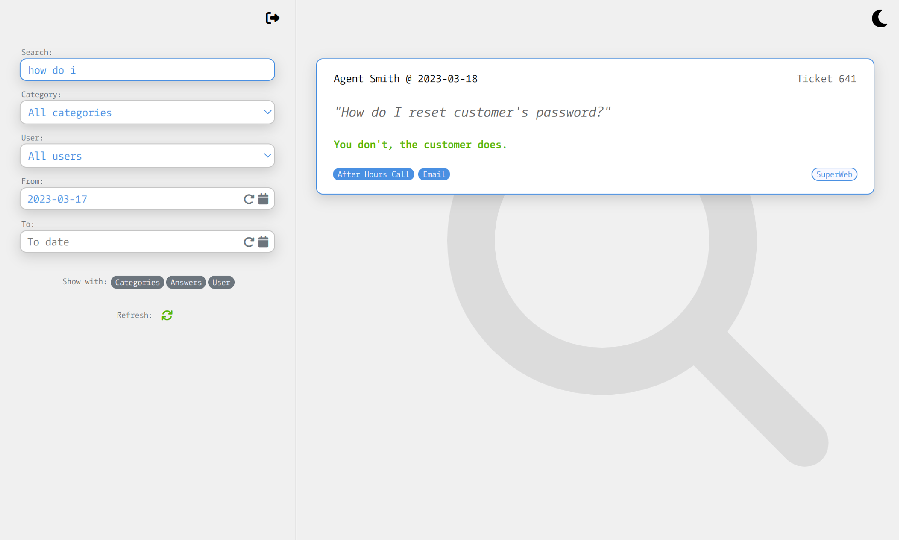

##

A simple webapp for Sonar to call GraphQL and search for ticket questions.

Made with Laravel & Livewire:

- Instant search, toggle & filter with no page reload
- Filter by ticket category, user or date range
- "Show with" toggles results by whether a category, answer or user is present
- Quickly toggle results by specific date, instance, user, or category by clicking its badge
- Dark mode toggle

